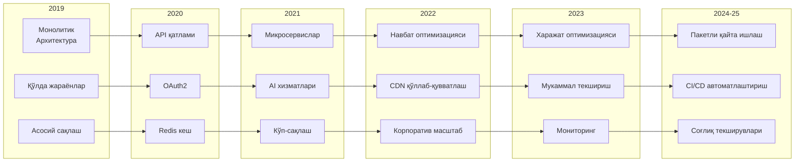

# Платформа эволюцияси вақт жадвали

## Умумий кўриниш
Бу диаграмма Jarima платформасининг 2019 йилдаги яратилишидан 2025 йилдаги ҳозирги ҳолатигача эволюциясини визуаллаштиради, турли соҳалардаги асосий воқеалар, функция қўшилишлари ва технологик ютуқларни кўрсатади.

## Эволюция вақт жадвали

```mermaid
timeline
    title Jarima платформаси эволюцияси (2019-2025)

    section Асос босқичи
        2019 Q2 : Платформа ишга туширилиши
                : Асосий қоидабузарликларни хабар қилиш
                : Қўлда кўриб чиқиш жараёни
                : Телефон кредити мукофотлари

        2019 Q3 : Маҳаллийлаштириш
                : Кўп тилли қўллаб-қувватлаш (RU, UZ)
                : ASBT интеграцияси бошланади
                : Вилоят/туман каталоглари

        2019 Q4 : Тўлов кенгайиши
                : Банк карта мукофотлари қўшилди
                : Модда асосидаги жаримелар
                : Ходимлар телефон рақамлари

    section Ўсиш босқичи
        2020 Q1 : OAuth2 амалга ошириш
                : Учинчи томон API кириши
                : Мижоз ҳисоб маълумотлари оқими
                : Bearer токен аутентификацияси

        2020 Q2 : Хавфсизлик яхшилаш
                : Фуқаро паролари
                : Телефон ноёблиги
                : Сессия бошқаруви

        2020 Q3 : Мукаммал функциялар
                : Ўтказма бошқаруви
                : Тўлиқ матнли қидирув
                : Фуқаро ҳужжатлари

        2020 Q4 : Платформа етуклиги
                : Webhook хабарномалари
                : Grant type қўллаб-қувватлаш
                : API барқарорлиги

    section Интеллект босқичи
        2021 Q1 : Иш самарадорлигини оптималлаштириш
                : Ҳисобот сонини кўриш
                : Индекс яхшиланишлари
                : Қидирувни яхшилаш

        2021 Q2 : AI интеграцияси
                : Видео кодлаш хизмати
                : Қоидабузарлик детектори
                : Кўп-MinIO қўллаб-қувватлаш
                : 2FA амалга ошириш

        2021 Q3 : Мукаммал қайта ишлаш
                : Мажбурий аниқлаш
                : Масофани ҳисоблаш
                : Ходимлар ҳужжатлари
                : Детектор журналлари

        2021 Q4 : Категоризация
                : Ҳуқуқбузарлик турлари
                : Турга асосланган гувоҳлик
                : Транзакция кузатуви

    section Масштаб босқичи
        2022 Q1 : Маълумотларни бошқариш
                : Ҳисобот ҳажмини кузатиш
                : Тур тафсилотлари
                : Яхшиланган текшириш

        2022 Q2 : Платформа функциялари
                : Навбат статистикаси
                : Архивланган видео баннерлари
                : CDN кўчиш воситалари

        2022 Q3 : Корпоратив қўллаб-қувватлаш
                : Максимал видео чегаралари
                : Корпоратив белгилаш
                : Токен бошқаруви

        2022 Q4 : Оптимизация
                : Детектор навбатини қайта ишлаш
                : Кодлаш яхшиланишлари
                : Устуворлик қайта ишлаш

    section Етуклик босқичи
        2023 Q1 : Молиявий эволюция
                : Фонд тўловларини тузатиш
                : Баланс текшируви
                : Хато ҳисоблари

        2023 Q2 : Операцион мукаммаллик
                : Хизмат кўрсатиш режимлари
                : Карта текшируви
                : Мукофот чегаралари

        2023 Q3 : Мукаммал функциялар
                : Хабарнома тизимлари
                : Иш самарадорлигини созлаш
                : Маълумотларни сақлаш

        2023 Q4 : Платформа барқарорлиги
                : Хатоларни тузатиш
                : Хавфсизлик ямоқлари
                : API такомиллаштириш

    section Инновация босқичи
        2024 Q1 : Тўлов инқилоби
                : Бирлаштирилган тўловлар
                : Пакетли қайта ишлаш
                : 70% харажатларни камайтириш

        2024 Q2 : Инфратузилма
                : GitHub Actions CI/CD
                : Docker оптимизацияси
                : Навбат мониторинги

        2024 Q3 : Фойдаланувчи тажрибаси
                : Кўриб чиқиш яхшиланишлари
                : Текшириш янгиланишлари
                : Иш самарадорлиги ютуқлари

        2024 Q4 : Мукаммал функциялар
                : Мураккаб LP текшируви
                : Мукофот фильтрлаш
                : Тизимни мустаҳкамлаш

    section Ҳозирги ҳолат
        2025 Q1 : Охирги янгиланишлар
                : Навбат соғлиғини текшириш
                : Видео ўчириш автоматлаштириш
                : Миниатюра вақтини тузатиш

        2025 Q2 : Давом этмоқда
                : Ҳуқуқбузарлик турини назорат қилиш
                : Кодлаш яхшиланишлари
                : Платформа оптимизацияси
```

## Батафсил эволюция таҳлили

### 1-босқич: Асос (2019)
**Асосий хусусиятлар**:
- Асосий функциялар билан MVP ёндашуви
- Қўлда жараёнлар устунлик қилади
- Асосий тўлов интеграцияси
- Ҳукумат тизими уланиши

**Асосий воқеалар**:
- Май 2019: Платформанинг дастлабки ишга туширилиши
- Июль 2019: Кўп тилли қўллаб-қувватлаш
- Август 2019: ASBT интеграцияси
- Декабрь 2019: Тўлов диверсификацияси

### 2-босқич: Ўсиш (2020)
**Асосий хусусиятлар**:
- API иқтисодиёти пайдо бўлиши
- Хавфсизликни мустаҳкамлаш
- Учинчи томонни ёқиш
- Масштаблилик асослари

**Асосий воқеалар**:
- Февраль 2020: OAuth2 сервери ишга туширилиши
- Апрель 2020: Ноёб телефон мажбурийлиги
- Август 2020: Ўтказма тизими
- Декабрь 2020: Webhook инфратузилмаси

### 3-босқич: Интеллект (2021)
**Асосий хусусиятлар**:
- AI/ML интеграцияси
- Тарқатилган қайта ишлаш
- Мукаммал хавфсизлик (2FA)
- Иш самарадорлигини оптималлаштириш

**Асосий воқеалар**:
- Апрель 2021: Кодлаш/Аниқлаш хизматлари
- Май 2021: Кўп-MinIO архитектураси
- Июль 2021: Мажбурий аниқлаш функцияси
- Декабрь 2021: Ҳуқуқбузарлик категоризацияси

### 4-босқич: Масштаб (2022)
**Асосий хусусиятлар**:
- Корпоратив функциялар
- Навбат оптимизацияси
- Мониторингни яхшилаш
- Платформа етилиши

**Асосий воқеалар**:
- Январь 2022: Мукаммал ҳуқуқбузарлик турлари
- Май 2022: Навбат статистикаси
- Октябрь 2022: Корпоратив қўллаб-қувватлаш
- Декабрь 2022: Устуворлик қайта ишлаш

### 5-босқич: Етуклик (2023)
**Асосий хусусиятлар**:
- Операцион мукаммаллик
- Харажатларни оптималлаштириш
- Барқарорлик яхшиланишлари
- Функцияларни такомиллаштириш

**Асосий воқеалар**:
- Март 2023: Тўлов яхшиланишлари
- Июнь 2023: Баланс текшируви
- Август 2023: Мукаммал текшириш
- Ноябрь 2023: Платформани мустаҳкамлаш

### 6-босқич: Инновация (2024-2025)
**Асосий хусусиятлар**:
- Инқилобий ўзгаришлар
- Харажатлар юқориши
- Автоматлаштиришга эътибор
- Келажакка тайёрлик

**Асосий воқеалар**:
- Февраль 2024: Бирлаштирилган тўловлар
- Март 2025: Соғлиқ мониторинги
- Апрель 2025: Автоматлаштириш скриптлари
- Июнь 2025: Охирги оптимизациялар

## Технология эволюцияси

## Бизнес кўрсаткичлари эволюцияси

```mermaid
graph TB
    subgraph "Фойдаланувчилар ўсиши"
        U1[2019: 5K фойдаланувчи] --> U2[2020: 25K фойдаланувчи]
        U2 --> U3[2021: 75K фойдаланувчи]
        U3 --> U4[2022: 150K фойдаланувчи]
        U4 --> U5[2023: 200K фойдаланувчи]
        U5 --> U6[2024-25: 250K+ фойдаланувчи]
    end

    subgraph "Қайта ишлаш қуввати"
        P1[2019: Кунига 100 видео] --> P2[2020: Кунига 500 видео]
        P2 --> P3[2021: Кунига 2K видео]
        P3 --> P4[2022: Кунига 5K видео]
        P4 --> P5[2023: Кунига 8K видео]
        P5 --> P6[2024-25: Кунига 10K+ видео]
    end

    subgraph "Харажат самарадорлиги"
        C1[2019: $5/қоидабузарлик] --> C2[2020: $3/қоидабузарлик]
        C2 --> C3[2021: $2/қоидабузарлик]
        C3 --> C4[2022: $1/қоидабузарлик]
        C4 --> C5[2023: $0.75/қоидабузарлик]
        C5 --> C6[2024-25: $0.50/қоидабузарлик]
    end
```

## Асосий эволюция намуналари

### 1. **Прогрессив мураккаблик**
- Қўлда жараёнлар билан оддий бошланган
- Аста-секин автоматлаштириш қўшилди
- AI билан ишлайдиган қайта ишлашга эволюция қилди
- Энди тўлиқ автоматлаштиришга эришмоқда

### 2. **Масштаблилик йўли**
- Битта сервер → Тарқатилган тизимлар
- Асосий сақлаш → Кўп-CDN архитектураси
- Индивидуал тўловлар → Пакетли қайта ишлаш
- Қўлда мониторинг → Автоматлаштирилган соғлиқ текширувлари

### 3. **Харажатларни оптималлаштириш йўли**
- Юқори транзакция харажатлари → Бирлаштирилган тўловлар (70% камайиш)
- Самарасиз қайта ишлаш → Навбат оптимизацияси
- Қўлда операциялар → Автоматлаштириш скриптлари
- Индивидуал хизматлар → Умумий инфратузилма

### 4. **Технологияни қабул қилиш**
- Анъанавий веб → API-биринчи платформа
- Синхрон → Асинхрон қайта ишлаш
- Қоида асосидаги → AI билан ишлайдиган аниқлаш
- Қўлда жойлаштириш → CI/CD автоматлаштириш

### 5. **Экотизим ўсиши**
- Ёпиқ тизим → Очиқ APIлар
- Битта мақсад → Платформа иқтисодиёти
- Фақат ҳукумат → Учинчи томон иловалари
- Маҳаллий таъсир → Минтақавий потенциал

## Келажак эволюция кўрсаткичлари

Эволюция намунасига асосланиб, платформа қуйидагилар учун жойлашган:

1. **Халқаро кенгайиш** (2025-2026)
   - Кўп давлатли қўллаб-қувватлаш
   - Валюта мослашувчанлиги
   - Тартибга солиш мувофиқлиги

2. **Мукаммал AI** (2026-2027)
   - Башоратли аналитика
   - Реал вақтда олдини олиш
   - Автоном қайта ишлаш

3. **Платформа трансформацияси** (2027-2028)
   - Йўл ҳаракати қоидабузарликларидан ташқари
   - Ақлли шаҳар интеграцияси
   - Кенг қамровли фуқаролик платформаси

4. **Блокчейн интеграцияси** (2028-2029)
   - Ўзгармас далиллар занжири
   - Марказлашмаган бошқарув
   - Чегараларни кесиб ўтувчи операциялар