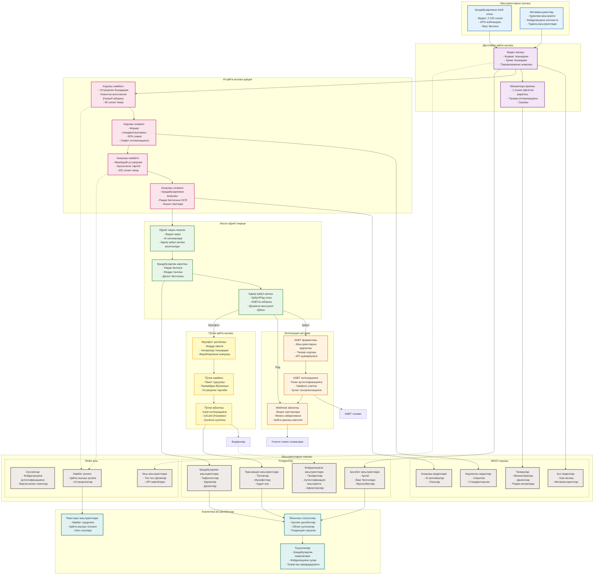

# Маълумотлар оқими диаграммаси

## Умумий кўриниш
Бу диаграмма Jarima платформаси орқали маълумотларнинг тўлиқ оқимини тасвирлайди, бошланғич қоидабузарликни ушлашдан то охирги мукофот тарқатишгача. У маълумотлар қандай ўзгариши ва турли қайта ишлаш босқичлари орқали ҳаракатланишини, ҳар бир босқичда қиймат яратишини кўрсатади.

## Асосий маълумотлар оқими



## Маълумотларни қайта ишлаш босқичлари

### 1. Маълумотларни ушлаш босқичи
**Кириш маълумотлари**:
- **Видео**: 2-120 сонияли клиплар, турли форматлар
- **Жойлашув**: Аниқлик билан GPS координаталари
- **Вақт белгиси**: Қоидабузарликнинг аниқ вақти
- **Қурилма маълумоти**: Телефон модели, илова версияси
- **Фойдаланувчи контексти**: Фуқаро ID, ташкилот билан боғлиқлик

**Маълумотлар ҳажми**: Кунига ~2,000-3,000 ҳисобот

### 2. Дастлабки қайта ишлаш
**Текшириш қадамлари**:
- Формат мослашувчанлигини текшириш
- Видео давомийлигини текшириш (максимум 120 сония)
- Файл ҳажми чегаралари (мобил юклаш учун мақбул)
- Такрорланишни аниқлаш (бир нечта ҳисоботларни олдини олиш)

**Чиқиш**: Маълумотлар базасида яратилган ҳақиқий ҳисобот

### 3. AI қайта ишлаш қувури
**Кодлаш жараёни**:
- **Кириш**: Асл видео (турли форматлар)
- **Қайта ишлаш**: Изчил форматга стандартлаштириш
- **Сиқиш**: 60% ҳажмни камайтириш
- **Чиқиш**: Аниқлаш учун оптималлаштирилган видео
- **Иш самарадорлиги**: Ўртача 30 сония

**Аниқлаш жараёни**:
- **Кириш**: Кодланган видео
- **AI таҳлили**: 
  - Қоидабузарлик турини аниқлаш
  - Рақам белгисини таниш
  - Ишонч баллари
- **Чиқиш**: Аниқлаш натижалари билан изоҳланган видео
- **Аниқлик**: 95% аниқлаш даражаси

### 4. Инсон кўриб чиқиши
**Кўриб чиқиш маълумотлари тақдимоти**:
- Асл ва қайта ишланган видеолар
- AI аниқлаш натижалари
- Транспорт воситаси учун тарихий маълумотлар
- Ўхшаш қоидабузарлик намуналари

**Қарор маълумотлари ушланиши**:
- Тасдиқланган рақам белгиси
- Танланган қоидабузарлик моддаси
- Далил вақт белгилари
- Инспектор изоҳлари

### 5. Интеграция қатлами
**ASBT маълумотлар пакети**:
```json
{
  "violation_id": "uuid",
  "license_plate": "01A234BC",
  "article_code": "1234",
  "evidence": {
    "video_url": "secure_link",
    "images": ["base64_encoded"],
    "timestamp": "2024-01-01T12:00:00Z",
    "location": {"lat": 41.123, "lng": 69.456}
  },
  "inspector_id": "uuid",
  "confidence": 0.95
}
```

**Webhook воқеалари**:
- Ҳисобот яратилди
- Ҳолат ўзгарди
- Қоидабузарлик қабул/рад этилди
- Тўлов қайта ишланди

### 6. Тўлов қайта ишлаш
**Мукофот ҳисоблаш маълумотлари**:
- Ҳар бир модда учун асосий миқдор
- Кўпайтириш омиллари
- Кунлик/ойлик чегаралар
- Фойдаланувчига олдинги мукофотлар

**Тўлов пакети маълумотлари**:
- Провайдер бўйича гуруҳланган
- Устуворлик бўйича тартибланган
- Қайта уриниш маълумотини ўз ичига олади
- Транзакция ҳавола

## Маълумотларни сақлаш стратегияси

### PostgreSQL (Транзакцион маълумотлар)
- **Фойдаланувчи маълумотлари**: 250,000+ фуқаро ёзувлари
- **Ҳисоботлар**: Жами 500,000+ ҳисобот
- **Қоидабузарликлар**: 1M+ қоидабузарлик ёзувлари
- **Транзакциялар**: Тўлиқ аудит изи

### MinIO (Объект сақлаш)
- **Сақлаш ҳажми**: Кластерлар бўйлаб кўп терабайт
- **Объект турлари**:
  - Асл видеолар
  - Кодланган видеолар
  - Аниқлаш натижаси видеолари
  - Миниатюралар ва далил тасвирлари
- **Сақлаш**: 24 ойлик сиёсат

### Redis (Кеш ва сессия)
- **Сессия маълумотлари**: Фаол фойдаланувчи сессиялари
- **Кеш**: Тез-тез фойдаланиладиган маълумотлар
- **Навбат ҳолати**: Реал вақтда қайта ишлаш ҳолати

## Маълумотлар оқими кўрсаткичлари

### Ҳажм кўрсаткичлари
- **Кунлик видео юкламалари**: 2-3 ТБ
- **Қайта ишлаш ўтказувчанлиги**: Кунига 5,000-10,000 видео
- **Сақлаш ўсиши**: Кунига ~100 ГБ
- **API чақирувлари**: Ойига 10M+

### Иш самарадорлиги кўрсаткичлари
- **Юклашдан натижагача**: Ўртача 2-5 дақиқа
- **Кўриб чиқиш вақти**: Ҳар бир қоидабузарлик учун 30 сония
- **ASBT синхронизацияси**: Деярли реал вақт
- **Тўлов қайта ишлаш**: 24-48 соат

### Сифат кўрсаткичлари
- **Маълумотлар аниқлиги**: 95% (AI + инсон кўриб чиқиши)
- **Қайта ишлаш муваффақияти**: 99.9%
- **Тўлов муваффақияти**: Биринчи уринишда 97%
- **Маълумотлар тўлиқлиги**: 100% аудит изи

## Маълумотлар хавфсизлиги ва конфиденциаллиги

### Маълумотларни ҳимоя қилиш
- **Шифрлаш**: Тинчлик ҳолатида ва транзитда
- **Кириш назорати**: Рол асосидаги рухсатлар
- **Анонимлаштириш**: Аналитика ва тадқиқот учун
- **Сақлаш чегаралари**: 24 ойдан кейин автоматик ўчириш

### Аудит изи
- Ҳар бир маълумот ўзгартириш рўйхатга олинган
- Фойдаланувчи ҳаракатлари кузатилади
- Тизим операциялари қайд қилинади
- Тўлиқ сақлаш занжири

## Маълумотларга асосланган тушунчалар

### Намуна аниқлаш
- Қоидабузарлик марказларини аниқлаш
- Вақтга асосланган қоидабузарлик намуналари
- Такрорий ҳуқуқбузарларни кузатиш
- Ижро самарадорлиги

### Операцион интеллект
- Навбат иш самарадорлигини оптималлаштириш
- Ресурслардан фойдаланиш намуналари
- Хато даражаси таҳлили
- Фойдаланувчи хулқи тушунчалари

### Сиёсат таъсири
- Қоидабузарлик тенденцияси таҳлили
- Ижро самарадорлиги кўрсаткичлари
- Хулқ-атвор ўзгариши кўрсаткичлари
- ROI ҳисоблари