# Манфаатдорлар экотизими диаграммаси

## Умумий кўриниш
Бу диаграмма Jarima платформасидаги манфаатдорларнинг мураккаб экотизимини визуаллаштиради, уларнинг муносабатлари, ўзаро таъсирлари ва қиймат алмашинувларини кўрсатади. У платформа фуқаролар, ҳукумат, бизнес ва дастурчиларни боғлайдиган кўп томонли бозорни қандай яратишини намойиш этади.

## Экотизим диаграммаси

```mermaid
graph TB
    subgraph "Асосий манфаатдорлар"
        Citizens[Фуқаролар<br/>250,000+ фойдаланувчи]
        Govt[Ҳукумат<br/>Йўл ҳаракати хавфсизлиги бўлими]
        Staff[Ходимлар/Инспекторлар<br/>Қоидабузарликларни кўриб чиқади]
    end

    subgraph "Платформа ядроси"
        JP[Jarima платформаси<br/>- Видео қайта ишлаш<br/>- Қоидабузарликларни бошқариш<br/>- Тўлов тарқатиш]
    end

    subgraph "Бизнес экотизими"
        PayProv[Тўлов провайдерлари<br/>- Kash<br/>- UzCard]
        TelOp[Телеком операторлари<br/>- Beeline<br/>- Ucell<br/>- UzMobile]
        Banks[Банклар<br/>Карта эмитентлари]
    end

    subgraph "Дастурчилар экотизими"
        DevCom[Дастурчилар жамоаси<br/>500+ дастурчи]
        TPApps[Учинчи томон иловалари<br/>15+ илова]
        StartUps[Фуқаролик технология стартаплари<br/>20+ компания]
    end

    subgraph "Хизмат кўрсатувчилар"
        Cloud[Булутли инфратузилма<br/>- MinIO сақлаш<br/>- Ҳисоблаш]
        AI[AI хизматлари<br/>- Кодлаш<br/>- Детектор]
        Comms[Алоқа<br/>- SMS<br/>- Telegram]
    end

    subgraph "Фойда олувчилар"
        Society[Жамият<br/>- Хавфсизроқ йўллар<br/>- Қоидабузарликлар камайиши]
        Orgs[Ташкилотлар<br/>Автопарк бошқаруви]
        Research[Тадқиқотчилар<br/>Транспорт тадқиқотлари]
    end

    subgraph "Тартибга солиш"
        ASBT[ASBT<br/>Йўл ҳаракати бошқармаси]
        Legal[Ҳуқуқий асос<br/>- Маълумотлар хавфсизлиги<br/>- Далил қонунлари]
        Policy[Сиёсат ишлаб чиқувчилар<br/>Йўл ҳаракати қоидалари]
    end

    %% Асосий оқимлар
    Citizens -->|Ҳисоботлар<br/>Видеолар| JP
    JP -->|Мукофотлар<br/>$10M+| Citizens
    Staff -->|Кўриб чиқишлар<br/>Қарорлар| JP
    JP -->|Қоидабузарликлар<br/>Далиллар| ASBT
    ASBT -->|Жаримелар<br/>Ҳолат| JP
    Govt -->|Назорат<br/>Сиёсат| JP

    %% Бизнес экотизими
    JP -->|Тўловлар| PayProv
    PayProv -->|Кредитлар| TelOp
    PayProv -->|Ўтказмалар| Banks
    Banks -->|Хизматлар| Citizens

    %% Дастурчилар экотизими
    JP -->|APIлар<br/>Маълумотлар| DevCom
    DevCom -->|Иловалар<br/>Инновация| TPApps
    TPApps -->|Хизматлар| Citizens
    DevCom -->|Стартаплар| StartUps

    %% Хизмат кўрсатувчилар
    JP -->|Видеолар| Cloud
    JP -->|Қайта ишлаш| AI
    JP -->|Хабарлар| Comms
    Cloud -->|Сақлаш| JP
    AI -->|Аниқлаш| JP
    Comms -->|Етказиб бериш| Citizens

    %% Фойда олувчилар
    JP -->|Маълумотлар<br/>Тушунчалар| Society
    JP -->|Автопарк API| Orgs
    JP -->|Аналитика| Research
    Orgs -->|Ҳисоботлар| JP

    %% Тартибга солиш
    ASBT -->|Талаблар| JP
    Legal -->|Мувофиқлик| JP
    JP -->|Далиллар| Legal
    JP -->|Статистика| Policy
    Policy -->|Қоидалар| ASBT

    %% Стиллаштириш
    classDef primary fill:#bbdefb,stroke:#1565c0,stroke-width:3px
    classDef platform fill:#c8e6c9,stroke:#2e7d32,stroke-width:4px
    classDef business fill:#fff9c4,stroke:#f57f17,stroke-width:2px
    classDef developer fill:#e1bee7,stroke:#6a1b9a,stroke-width:2px
    classDef service fill:#ffccbc,stroke:#d84315,stroke-width:2px
    classDef benefit fill:#b2dfdb,stroke:#00695c,stroke-width:2px
    classDef regulatory fill:#f8bbd0,stroke:#c2185b,stroke-width:2px

    class Citizens,Govt,Staff primary
    class JP platform
    class PayProv,TelOp,Banks business
    class DevCom,TPApps,StartUps developer
    class Cloud,AI,Comms service
    class Society,Orgs,Research benefit
    class ASBT,Legal,Policy regulatory
```

## Манфаатдорлар категориялари

### Асосий манфаатдорлар
Булар платформанинг асосий фойдаланувчилари ва операторлари:

1. **Фуқаролар (250,000+ фойдаланувчи)**
   - Қоидабузарлик ҳисоботларини тақдим этади
   - Пул мукофотларини олади
   - Ҳисобот ҳолатини кузатади
   - **Қиймат алмашинуви**: Мукофотлар учун ҳисоботлар

2. **Ҳукумат (Йўл ҳаракати хавфсизлиги бўлими)**
   - Платформага эгалик қилади ва назорат қилади
   - Сиёсат ва қоидаларни белгилайди
   - Самарадорликни кузатади
   - **Қиймат алмашинуви**: Ижро учун молиялаштириш

3. **Ходимлар/Инспекторлар**
   - Тақдим этилган қоидабузарликларни кўриб чиқади
   - Юбориш қарорларини қабул қилади
   - Баҳсли ҳолатларни бошқаради
   - **Қиймат алмашинуви**: Хизмат учун иш билан таъминлаш

### Платформа ядроси
Jarima платформаси марказий оркестратор сифатида хизмат қилади:
- Видеоларни қайта ишлайди ва қоидабузарликларни бошқаради
- Тўловлар ва хабарномаларни тарқатади
- APIлар ва интеграцияларни таъминлайди
- Маълумотлар яхлитлиги ва хавфсизлигини сақлайди

### Бизнес экотизими
Операцияларни таъминлайдиган молиявий ва телекоммуникация ҳамкорлари:

1. **Тўлов провайдерлари**
   - Kash: Телефон кредитини тарқатиш
   - UzCard: Банк карта ўтказмалари
   - **Қиймат**: Транзакция тўловлари (йилига ~$1M)

2. **Телеком операторлари**
   - Телефон кредити харидларини олади
   - SMS хизматларини таъминлайди
   - **Қиймат**: Кредитлардан ARPU ошиши

3. **Банклар**
   - Карта транзакцияларини қайта ишлайди
   - Тўлов инфратузилмасини таъминлайди
   - **Қиймат**: Транзакция ҳажми ва тўловлар

### Дастурчилар экотизими
Платформа имкониятларини кенгайтирувчи инновация ҳамкорлари:

1. **Дастурчилар жамоаси (500+ аъзо)**
   - Учинчи томон иловаларини яратади
   - Платформани яхшилашга ҳисса қўшади
   - **Қиймат**: API кириши ва маълумотлар

2. **Учинчи томон иловалари (15+ фаол)**
   - Навигация ва хавфсизлик иловалари
   - Автопарк бошқарув ечимлари
   - Ҳуқуқий хизмат платформалари
   - **Қиймат**: Фойдаланувчи базасига кириш

3. **Фуқаролик технология стартаплари (20+ компания)**
   - Платформа APIлари асосида қуради
   - Инновацион ечимлар яратади
   - **Қиймат**: Платформа ва тажриба

### Хизмат кўрсатувчилар
Платформа операцияларини таъминлайдиган техник инфратузилма:

1. **Булутли инфратузилма**
   - Объект сақлаш учун MinIO
   - Ҳисоблаш ресурслари
   - **Қиймат**: Йилига ~$500K шартномалар

2. **AI хизматлари**
   - Видео кодлаш хизмати
   - Қоидабузарликни аниқлаш AI
   - **Қиймат**: Қайта ишлаш тўловлари

3. **Алоқа хизматлари**
   - SMS провайдерлари
   - Telegram интеграцияси
   - **Қиймат**: Хабар етказиб бериш тўловлари

### Фойда олувчилар
Платформа операцияларидан қиймат олувчи билвосита манфаатдорлар:

1. **Жамият**
   - Хавфсизроқ йўллар (йилига 150-200 ҳаёт сақланади)
   - Йўл ҳаракати қоидабузарликлари камайиши (40% камайиш)
   - **Қиймат**: Жамоат хавфсизлиги яхшиланиши

2. **Ташкилотлар**
   - Автопарк қоидабузарликларини бошқариш
   - Ҳайдовчи хулқини кузатиш
   - **Қиймат**: Операцион самарадорлик

3. **Тадқиқотчилар**
   - Транспорт маълумотларига кириш
   - Хулқ-атвор тадқиқотлари
   - **Қиймат**: Тадқиқот тушунчалари

### Тартибга солиш чегараси
Назорат ва мувофиқликни таъминлайдиган ҳукумат органлари:

1. **ASBT (Йўл ҳаракати бошқармаси)**
   - Қоидабузарлик далилларини олади
   - Расмий жаримелар чиқаради
   - **Қиймат**: Ижро самарадорлиги

2. **Ҳуқуқий асос**
   - Маълумотлар хавфсизлиги қоидалари
   - Далилларнинг мақбуллиги
   - **Қиймат**: Ҳуқуқий мувофиқлик

3. **Сиёсат ишлаб чиқувчилар**
   - Сиёсий қарорлар учун маълумотлардан фойдаланади
   - Йўл ҳаракати қоидаларини яратади
   - **Қиймат**: Далилларга асосланган сиёсат

## Қиймат оқими таҳлили

### Пул оқимлари
- **Фуқаролар → Платформа**: Бепул хизмат
- **Платформа → Фуқаролар**: Мукофотларда $10M+
- **Платформа → Тўлов провайдерлари**: Тўловларда ~$300K
- **Ҳукумат → Платформа**: Операцион молиялаштириш
- **ASBT → Ҳуқуқбузарлар**: Жарима йиғиш

### Маълумотлар оқимлари
- **Фуқаролар → Платформа**: Қоидабузарлик видеолари ва ҳисоботлар
- **Платформа → ASBT**: Тасдиқланган қоидабузарликлар
- **Платформа → Дастурчилар**: APIлар ва аналитика
- **Платформа → Тадқиқотчилар**: Анонимлаштирилган маълумотлар
- **Платформа → Сиёсат ишлаб чиқувчилар**: Статистика

### Хизмат оқимлари
- **Платформа → Фуқаролар**: Қоидабузарликларни қайта ишлаш
- **Ходимлар → Фуқаролар**: Адолатли кўриб чиқиш жараёни
- **Дастурчилар → Фуқаролар**: Яхшиланган хизматлар
- **Платформа → Ташкилотлар**: Автопарк бошқаруви

## Тармоқ эффектлари

1. **Тўғридан-тўғри тармоқ эффектлари**
   - Кўпроқ фуқаролар = яхшироқ қамров
   - Кўпроқ ҳисоботлар = хавфсизроқ йўллар
   - Кўпроқ дастурчилар = яхшироқ иловалар

2. **Билвосита тармоқ эффектлари**
   - Кўпроқ қайта ишланган қоидабузарликлар = кўпроқ мукофотлар
   - Кўпроқ мукофотлар = кўпроқ фуқаролар
   - Кўпроқ маълумотлар = яхшироқ AI аниқлаш

3. **Экотизим тармоқ эффектлари**
   - Кўпроқ иловалар = кўпроқ фойдаланувчи жалб қилиш
   - Кўпроқ жалб қилиш = кўпроқ платформа қиймати
   - Кўпроқ қиймат = кўпроқ экотизим ўсиши

## Стратегик тушунчалар

1. **Кўп томонли платформа**: Фуқаролар, ҳукумат ва бизнес манфаатларини муваффақиятли мувозанатлайди
2. **Экотизим оркестрацияси**: Платформа марказий қиймат яратувчи ва тарқатувчи сифатида ишлайди
3. **Барқарор модель**: Тармоқ эффектлари орқали ўзини-ўзи кучайтирувчи ўсиш
4. **Ижтимоий таъсир**: Ўлчанадиган жамоат хавфсизлиги фойдаларини етказади
5. **Инновация маркази**: Учинчи томон инновация ва тадбиркорликни таъминлайди