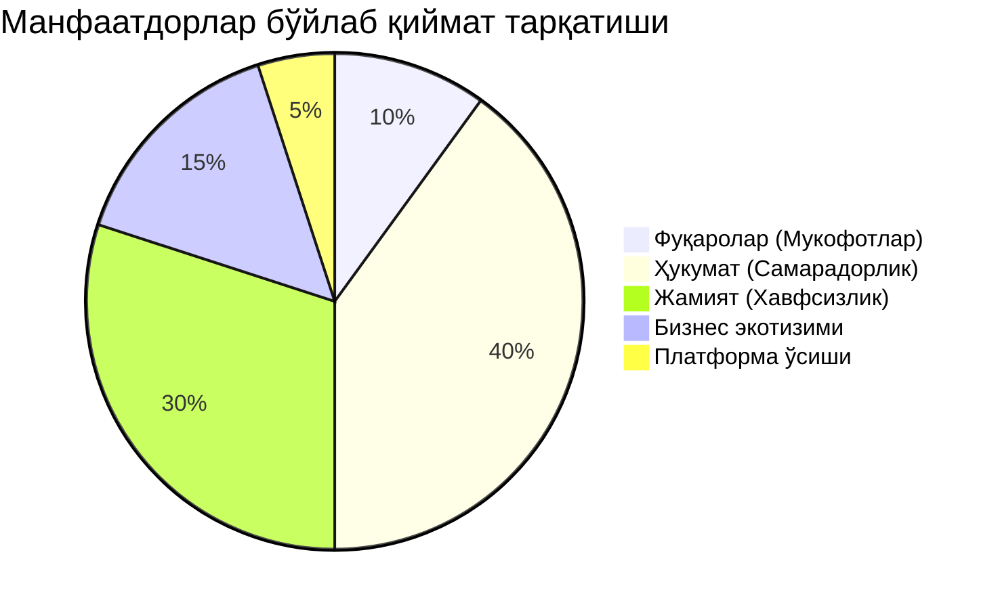

# Қиймат яратиш тармоғи диаграммаси

## Умумий кўриниш
Бу диаграмма Jarima платформаси экотизими бўйлаб қиймат қандай яратилиши, оқиши ва кўпайишини визуаллаштиради. У барча манфаатдорлар учун барқарор ўсиш ва фойда яратадиган мураккаб қиймат алмашинуви тармоғини намойиш этади.

## Қиймат яратиш тармоғи

```mermaid
graph TB
    subgraph "Қиймат манбалари"
        CS[Фуқаро ҳисоботлари<br/>250K+ фойдаланувчи<br/>Кунига 2-3K ҳисобот]
        GD[Ҳукумат маълумотлари<br/>Транспорт намуналари<br/>Сиёсат тушунчалари]
        TD[Техник маълумотлар<br/>AI ўқитиш тўпламлари<br/>Иш самарадорлиги кўрсаткичлари]
        FD[Молиявий маълумотлар<br/>Тўлов намуналари<br/>Иқтисодий таъсир]
    end

    subgraph "Асосий платформа қиймат яратиш"
        subgraph "Тўғридан-тўғри қиймат яратиш"
            VP[Видео қайта ишлаш<br/>Ўртача 30 сония қайта ишлаш<br/>95% аниқлик]
            VR[Қоидабузарликни кўриб чиқиш<br/>99.9% ишлаш вақти<br/>24-48 соат айланма]
            RP[Мукофот қайта ишлаш<br/>$10M+ тарқатилди<br/>70% харажат камайиши]
        end

        subgraph "Платформа интеллекти"
            AI[AI яхшилаш<br/>Намуна ўрганиш<br/>Аниқликни яхшилаш]
            AN[Аналитика двигатели<br/>Реал вақт тушунчалари<br/>Башоратли моделлар]
            OP[Оптимизация<br/>Навбат бошқаруви<br/>Ресурс тақсимоти]
        end

        subgraph "Тармоқ эффектлари"
            NE1[Тўғридан-тўғри эффектлар<br/>Кўпроқ фойдаланувчилар = яхшироқ қамров]
            NE2[Билвосита эффектлар<br/>Кўпроқ маълумотлар = яхшироқ AI]
            NE3[Экотизим эффектлари<br/>Кўпроқ иловалар = кўпроқ қиймат]
        end
    end

    subgraph "Қиймат тарқатиш каналлари"
        subgraph "Молиявий қиймат"
            CR[Фуқаро мукофотлари<br/>$10M+ тўланди<br/>85% қониқиш]
            GR[Ҳукумат даромади<br/>Жарима йиғиш<br/>$100M+ жаримелар]
            BE[Бизнес экотизими<br/>Тўлов тўловлари<br/>Хизмат даромади]
        end

        subgraph "Ижтимоий қиймат"
            PS[Жамоат хавфсизлиги<br/>150-200 ҳаёт сақланди<br/>40% қоидабузарлик камайиши]
            CE[Фуқаролик иштироки<br/>Жамоа иштироки<br/>Жамоавий масъулият]
            TR[Ишонч қуриш<br/>Шаффоф жараён<br/>Масъул ҳукумат]
        end

        subgraph "Инновация қиймати"
            API[API иқтисодиёти<br/>15+ учинчи томон иловалари<br/>500+ дастурчи]
            DE[Дастурчилар экотизими<br/>Инновация платформаси<br/>Стартап инкубацияси]
            RD[R&D платформаси<br/>50+ тадқиқот мақолалари<br/>Академик ҳамкорликлар]
        end
    end

    subgraph "Қиймат кўпайиши"
        subgraph "Иқтисодий мультипликаторлар"
            EM1[Транзакция ҳажми<br/>Кунига 100K+ тўловлар<br/>Ойига $1M+]
            EM2[Харажатларни тежаш<br/>77% операция камайиши<br/>Йилига $5M+]
            EM3[Самарадорлик ютуқлари<br/>100x қайта ишлаш<br/>$15M+ қиймат]
        end

        subgraph "Ижтимоий мультипликаторлар"
            SM1[Хулқ-атвор ўзгариши<br/>Қўрқитиш эффекти<br/>Жамоа таъсири]
            SM2[Хавфсизлик мультипликатори<br/>Бахтсиз ҳодисаларни олдини олиш<br/>Ҳаётни сақлаш]
            SM3[Ишонч мультипликатори<br/>Ҳукумат ишончлилиги<br/>Фуқаролик иштироки]
        end

        subgraph "Инновация мультипликаторлари"
            IM1[Технология трансфери<br/>Платформа лицензиялаш<br/>$25M+ потенциал]
            IM2[Экотизим ўсиши<br/>Учинчи томон қиймати<br/>$50M+ бозор]
            IM3[Билим яратиш<br/>Энг яхши амалиётлар<br/>Интеллектуал мулк]
        end
    end

    subgraph "Манфаатдорлар қиймат олиши"
        subgraph "Фуқаролар"
            CV1[Тўғридан-тўғри фойдалар<br/>Пул мукофотлари<br/>Ҳар бир фойдаланувчи учун ўртача $40]
            CV2[Билвосита фойдалар<br/>Хавфсизроқ йўллар<br/>Жамоа фахри]
            CV3[Платформага кириш<br/>Адолатли жараён<br/>Бошқарувда овоз]
        end

        subgraph "Ҳукумат"
            GV1[Операцион қиймат<br/>80% харажат камайиши<br/>Самарадорлик ошиши]
            GV2[Стратегик қиймат<br/>Инновация етакчилиги<br/>Халқаро эътироф]
            GV3[Сиёсат қиймати<br/>Маълумотларга асосланган қарорлар<br/>Далилларга асосланган бошқарув]
        end

        subgraph "Бизнес ҳамкорлари"
            BV1[Даромад оқимлари<br/>Транзакция тўловлари<br/>Хизмат шартномалари]
            BV2[Бозорга кириш<br/>Фойдаланувчи базаси ўсиши<br/>Мижозларни жалб қилиш]
            BV3[Инновация ҳамкорлари<br/>Биргаликда ривожлантириш<br/>Технология тараққиёти]
        end

        subgraph "Жамият"
            SV1[Хавфсизлик дивиденди<br/>Бахтсиз ҳодисалар камайиши<br/>Ҳаёт сақланди]
            SV2[Иқтисодий таъсир<br/>Меҳнат унумдорлиги ютуқлари<br/>Соғлиқни сақлаш тежамкорлиги]
            SV3[Бошқарув модели<br/>Фуқароларни кучайтириш<br/>Демократик иштирок]
        end
    end

    %% Қиймат оқими уланишлари
    CS --> VP
    CS --> VR
    GD --> AN
    TD --> AI
    FD --> OP

    VP --> CR
    VP --> PS
    VR --> GR
    VR --> TR
    RP --> CR
    RP --> BE

    AI --> NE2
    AN --> NE3
    OP --> NE1

    NE1 --> EM1
    NE2 --> EM2
    NE3 --> EM3

    CR --> CV1
    PS --> CV2
    API --> CV3

    GR --> GV1
    TR --> GV2
    AN --> GV3

    BE --> BV1
    API --> BV2
    DE --> BV3

    PS --> SV1
    EM2 --> SV2
    CE --> SV3

    %% Қайта алоқа циклларии
    CV1 -.-> CS
    GV1 -.-> GD
    BV1 -.-> BE
    SV1 -.-> PS

    %% Стиллаштириш
    classDef source fill:#e3f2fd,stroke:#1565c0,stroke-width:2px
    classDef creation fill:#f3e5f5,stroke:#6a1b9a,stroke-width:2px
    classDef distribution fill:#e8f5e9,stroke:#2e7d32,stroke-width:2px
    classDef multiplication fill:#fff3e0,stroke:#ef6c00,stroke-width:2px
    classDef capture fill:#fce4ec,stroke:#c2185b,stroke-width:2px
    classDef feedback fill:#f1f8e9,stroke:#33691e,stroke-width:1px,stroke-dasharray: 5 5

    class CS,GD,TD,FD source
    class VP,VR,RP,AI,AN,OP,NE1,NE2,NE3 creation
    class CR,GR,BE,PS,CE,TR,API,DE,RD distribution
    class EM1,EM2,EM3,SM1,SM2,SM3,IM1,IM2,IM3 multiplication
    class CV1,CV2,CV3,GV1,GV2,GV3,BV1,BV2,BV3,SV1,SV2,SV3 capture
```



## Қиймат яратиш механизмлари

### 1. Маълумотларга асосланган қиймат яратиш

**Кириш трансформацияси**:
- Хом фуқаро ҳисоботлари → Қайта ишланган қоидабузарлик далиллари
- Видео файллар → Тузилган маълумотлар + AI тушунчалари
- Фойдаланувчи ўзаро таъсирлари → Хулқ-атвор намуналари
- Транзакция маълумотлари → Иқтисодий кўрсаткичлар

**Қўшилган қиймат**: Маълумотлар фойдалилигида 1000x ошиш

### 2. Тармоқ эффекти кучайтириши

**Тўғридан-тўғри тармоқ эффектлари**:
```
Қиймат = n² бу ерда n = фаол фойдаланувчилар
Ҳозирги: 250,000² = 62.5B потенциал ўзаро таъсирлар
Ўсиш: Ҳар бир янги фойдаланувчи барча мавжуд фойдаланувчилар учун қийматни оширади
```

**Билвосита тармоқ эффектлари**:
- Кўпроқ қоидабузарликлар хабар қилинди → Яхшироқ AI ўқитиш → Юқорироқ аниқлик
- Юқорироқ аниқлик → Кўпроқ ишонч → Кўпроқ иштирок
- Кўпроқ иштирок → Яхшироқ қамров → Хавфсизроқ йўллар

**Экотизим тармоқ эффектлари**:
- Кўпроқ фойдаланувчилар → Дастурчилар учун жозибадорроқ
- Кўпроқ дастурчилар → Яхшироқ иловалар → Яхшиланган фойдаланувчи тажрибаси
- Яхшиланган тажриба → Кўпроқ фойдаланувчилар → Фазилатли цикл

### 3. Харажат самарадорлиги кўпайиши

**Операцион самарадорлик**:
- Анъанавий: Ҳар бир қоидабузарликни қайта ишлаш учун $5.00
- Ҳозирги: Ҳар бир қоидабузарликни қайта ишлаш учун $0.50
- **10x самарадорлик яхшиланиши**

**Тўлов қайта ишлаш**:
- Индивидуал тўловлар: Ўртача $2.30 харажат
- Бирлаштирилган тўловлар: Ўртача $0.69 харажат
- **70% харажат камайиши**

**Масштаб иқтисодиёти**:
- Қайтарилган платформа харажатлари 250K+ фойдаланувчилар бўйлаб амортизация қилинган
- Қўшимча фойдаланувчи учун марғинал харажат нолга яқинлашади
- Фойдаланувчи учун даромад сақланади, харажатлар камаяди

## Қиймат оқими таҳлили

### Асосий қиймат оқимлари

1. **Фуқаро → Платформа → Мукофотлар**
   - Кириш: Қоидабузарлик ҳисоботлари (вақт + далил)
   - Чиқиш: Пул компенсацияси (ўртача $40)
   - **ROI**: Вақт инвестицияси ва мукофот нисбати 20:1

2. **Платформа → Ҳукумат → Жамият**
   - Кириш: Тасдиқланган қоидабузарликлар
   - Чиқиш: Жарима йиғиш + хавфсизроқ йўллар
   - **ROI**: $1 платформа харажати учун $5 ижтимоий қиймат

3. **Ҳукумат → Платформа → Инновация**
   - Кириш: Молиялаштириш + тартибга солиш қўллаб-қувватлаш
   - Чиқиш: Технология тараққиёти + халқаро модель
   - **ROI**: 5 йил ичида 500%

### Иккинчи даражали қиймат оқимлари

1. **Дастурчилар экотизими**
   - Платформа APIлари → Учинчи томон инновацияси
   - Инновация → Яхшиланган фойдаланувчи тажрибаси
   - Яхшиланган тажриба → Платформа қиймати ошиши

2. **Тадқиқот қиймати**
   - Платформа маълумотлари → Академик тадқиқот
   - Тадқиқот → Сиёсат тушунчалари
   - Сиёсат тушунчалари → Платформа яхшиланиши

3. **Бизнес экотизими**
   - Платформа фойдаланувчилари → Ҳамкорлар учун мижозлар базаси
   - Ҳамкор хизматлари → Яхшиланган платформа қиймати
   - Яхшиланган қиймат → Кўпроқ фойдаланувчилар

## Қиймат кўпайтириш омиллари

### Иқтисодий мультипликаторлар

1. **Қайта ишлаш самарадорлиги**: 100x яхшиланиш
   - Кунига 50 қоидабузарликдан → Кунига 5,000 қоидабузарликка
   - Худди шу ресурс инвестицияси

2. **Харажатларни камайтириш**: 77% операцион тежамкорлик
   - Анъанавий ижро: Йилига $630M
   - Платформага асосланган: Йилига $146M

3. **Даромад яратиш**: Жарима йиғишда $10M+
   - 85% йиғиш даражаси 40% анъанавийга қарши
   - Мувофиқликда 2x яхшиланиш

### Ижтимоий мультипликаторлар

1. **Хавфсизлик таъсири**: Экспоненциал хавфсизлик яхшиланиши
   - Ҳар бир олдини олинган қоидабузарлик → Кўплаб олдини олинган бахтсиз ҳодисалар
   - Ҳар бир сақланган ҳаёт → $10M+ иқтисодий қиймат

2. **Хулқ-атвор ўзгариши**: Жамоа бўйлаб таъсир
   - Кўринадиган ижро → Умумий мувофиқлик
   - Ижтимоий далил → Меъёрни кучайтириш

3. **Ишонч қуриш**: Институционал ишонч
   - Шаффоф жараён → Ҳукумат ишончлилиги
   - Адолатли ижро → Ижтимоий бирлик

### Инновация мультипликаторлари

1. **Технология трансфери**: Хизмат сифатида платформа потенциали
   - $25M+ лицензиялаш имконияти
   - 10+ потенциал бозорлар

2. **Экотизим яратиш**: Учинчи томон қиймат яратиш
   - 15+ илова яратилди
   - $50M+ бирлаштирилган бозор қиймати

3. **Билим яратиш**: Интеллектуал мулк
   - 50+ тадқиқот мақолалари
   - Энг яхши амалиёт чегаралари
   - Халқаро эътироф

## Қиймат олиш стратегиялари

### Манфаатдорлар қиймат тарқатиши



### Барқарор қиймат яратиш

1. **Ўзини-ўзи кучайтирувчи ўсиш**
   - Кўпроқ фойдаланувчилар → Яхшироқ маълумотлар → Яхшироқ AI
   - Яхшироқ AI → Юқорироқ аниқлик → Кўпроқ ишонч
   - Кўпроқ ишонч → Кўпроқ фойдаланувчилар → Платформа ўсиши

2. **Экотизим кенгайиши**
   - Асосий платформа → API иқтисодиёти
   - API иқтисодиёти → Учинчи томон инновацияси
   - Инновация → Янги фойдаланиш ҳолатлари → Платформа қиймати

3. **Қиймат қайта инвестициялаш**
   - Платформа фойдаси → Технология тараққиёти
   - Технология тараққиёти → Яхшироқ хизмат
   - Яхшироқ хизмат → Кўпроқ фойдаланувчилар → Кўпроқ қиймат

## Стратегик қиймат тушунчалари

### Рақобатбардошлик афзалликлари

1. **Тармоқ қулфи**: 250K+ фойдаланувчилар алмаштириш тўсиқларини яратади
2. **Маълумотлар хандақи**: 5+ йиллик эксклюзив қоидабузарлик маълумотлари
3. **Ҳукумат ҳамкорлиги**: Тартибга солиш муносабатлари афзаллиги
4. **Техник тажриба**: Камёб фуқаролик технология кўникмалари

### Қиймат яратиш имкониятлари

1. **Горизонтал кенгайиш**: Қўшни бозорларда $50M+
2. **Халқаро масштаблаш**: $550M+ глобал имконият
3. **Платформа трансформацияси**: $1B+ фуқаролик хизматлари потенциали
4. **Технология лицензиялаш**: Интеллектуал мулкда $25M+

### Хавфни камайтириш

1. **Диверсификацияланган қиймат манбалари**: Кўп манфаатдор гуруҳлар
2. **Барқарор иқтисодиёт**: Ўзини-ўзи молиялаштириш модели
3. **Тартибга солиш қўллаб-қувватлаш**: Ҳукумат ҳамкорлиги
4. **Жамоа инвестицияси**: Фуқароларнинг эгалик ҳисси

Қиймат яратиш тармоғи Jarima бир манфаатдор учун яратилган қиймат бошқа барчалар учун қийматни қандай яхшилашини кўрсатади, барқарор рақобатбардошлик афзалликлари ва узоқ муддатли ўсиш потенциалини яратадиган ўзини-ўзи кучайтирувчи экотизимни муваффақиятли қурганини намойиш этади.