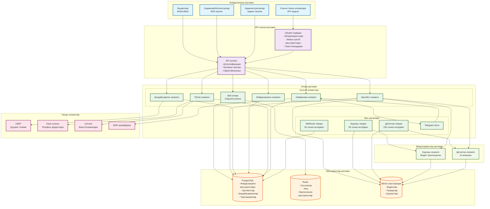

# Тизим архитектураси диаграммаси

## Умумий кўриниш
Бу диаграмма Jarima платформасининг кенг қамровли тизим архитектурасини тасвирлайди, турли компонентлар йўл ҳаракати қоидабузарликларини хабар қилиш учун масштабланадиган фуқаролик технология ечимини яратиш учун қандай ўзаро таъсир қилишини кўрсатади.

## Архитектура диаграммаси

## Компонент тавсифи

### Фойдаланувчи қатлами
- **Фуқаролар**: Веб ёки мобил орқали қоидабузарликларни хабар қилувчи асосий фойдаланувчилар
- **Ходимлар/Инспекторлар**: Қоидабузарликларни кўриб чиқувчи ва қайта ишлайдиган ҳукумат ходимлари
- **Администраторлар**: Фойдаланувчилар ва конфигурацияни бошқарувчи тизим администраторлари
- **Учинчи томон иловалари**: OAuth2 APIлари орқали платформага кирувчи ташқи иловалар

### API шлюзи қатлами
- **API шлюзи**: Аутентификация, тезликни чеклаш ва йўналишни бошқарувчи марказий кириш нуқтаси
- **OAuth2 сервери**: Кўп грант турлари билан учинчи томон иловалари учун авторизацияни бошқаради

### Илова қатлами
#### Асосий хизматлар
- **Веб илова**: Бизнес мантиғини бошқарувчи асосий Clojure/Luminus монолити
- **Ҳисобот хизмати**: Қоидабузарлик ҳисоботларини тақдим этишдан ечимгача бошқаради
- **Қоидабузарлик хизмати**: Ҳисоботлар ичидаги алоҳида қоидабузарликларни қайта ишлайди
- **Фойдаланувчи хизмати**: Фойдаланувчи бошқаруви ва аутентификацияни бошқаради
- **Тўлов хизмати**: Мукофотлар ва тўлов қайта ишлашни бошқаради
- **Хабарнома хизмати**: SMS, электрон почта ва Telegram орқали огоҳлантиришлар юборади

#### Фон ишчилари
- **Кодлаш тикери**: Ҳар 60 сонияда видео кодлаш навбатини қайта ишлайди
- **Детектор тикери**: Ҳар 100 сонияда AI аниқлаш навбатини бошқаради
- **Webhook тикери**: OAuth мижозларига webhook хабарномаларини етказади
- **Telegram боти**: Telegram хабарлашуви ва хабарномаларини бошқаради

### Микросервислар қатлами
- **Кодлаш хизмати**: Видео транскодлаш ва стандартлаштириш учун ташқи хизмат
- **Детектор хизмати**: Қоидабузарликни аниқлаш ва рақам белгисини таниш учун AI билан ишлайдиган хизмат

### Маълумотлар қатлами
- **PostgreSQL**: Барча транзакцион маълумотлар учун асосий маълумотлар базаси
- **Redis**: Сессия сақлаш ва кешлаш қатлами
- **MinIO**: Видеолар ва тасвирлар учун тарқатилган объект сақлаш

### Ташқи хизматлар
- **ASBT**: Ҳукумат йўл ҳаракати қоидабузарлик тизими интеграцияси
- **Kash шлюзи**: Телефон кредитини тўлдириш учун тўлов провайдери
- **UzCard**: Банк карта ўтказмалари учун миллий тўлов тизими
- **SMS провайдери**: SMS хабарнома етказиб бериш

## Асосий архитектура қарорлари

1. **Гибрид архитектура**: CPU талаб қиладиган вазифалар микросервислар сифатида монолитдаги асосий бизнес мантиғи
2. **Навбатга асосланган қайта ишлаш**: Масштаблилик учун асинхрон қайта ишлаш
3. **Кўп сақлаш стратегияси**: Маълумотлар учун PostgreSQL, кеш учун Redis, объектлар учун MinIO
4. **Хизмат изоляцияси**: Circuit breaker билан ўралган ташқи хизматлар
5. **Горизонтал масштаблилик**: Осон масштаблашни таъминлайдиган ҳолатсиз дизайн

## Иш самарадорлиги хусусиятлари

- **Сўров бошқариш**: 10,000+ сўров/дақиқа қуввати
- **Видео қайта ишлаш**: Ўртача 30 сония қайта ишлаш вақти
- **Тўлов қайта ишлаш**: Кунига 100,000+ транзакция қобилияти
- **Сақлаш**: CDNлар бўйлаб кўп терабайтли видео сақлаш
- **Мавжудлик**: 99.9% ишлаш вақтига эришилди

## Хавфсизлик хусусиятлари

- **Кўп қатламли аутентификация**: Сессия, OAuth2, API калитлари, 2FA
- **Рол асосидаги кириш назорати**: Ҳар бир фойдаланувчи тури учун аниқ рухсатлар
- **Маълумотларни шифрлаш**: Тинчлик ҳолатида ва транзитда шифрлаш
- **Аудит журнали**: Барча операцияларнинг тўлиқ изи
- **API хавфсизлиги**: Тезликни чеклаш, CORS, киритиш текшируви