# Data Flow Diagram

## Overview
This diagram illustrates the complete data flow through the Jarima platform, from initial violation capture to final reward distribution. It shows how data transforms and moves through various processing stages, creating value at each step.

## Main Data Flow

```mermaid
flowchart TB
    subgraph "Data Capture"
        VR[Violation Recording<br/>- Video: 2-120 seconds<br/>- GPS Location<br/>- Timestamp]
        MD[Metadata<br/>- Device Info<br/>- User Context<br/>- Network Data]
    end

    subgraph "Initial Processing"
        VU[Video Upload<br/>- Format Validation<br/>- Size Check<br/>- Duplicate Detection]
        TG[Thumbnail Generation<br/>- 1s Offset Extract<br/>- Image Optimization<br/>- Storage]
    end

    subgraph "AI Processing Pipeline"
        EQ[Encoding Queue<br/>- Priority Management<br/>- Trust-based Skip<br/>- 60s Ticker]
        ES[Encoding Service<br/>- Format Standardization<br/>- Compression 60%<br/>- Quality Optimization]
        DQ[Detection Queue<br/>- Force Priority<br/>- Chronological Order<br/>- 100s Ticker]
        DS[Detection Service<br/>- Violation Detection<br/>- License Plate OCR<br/>- Confidence Scoring]
    end

    subgraph "Human Review"
        RD[Review Dashboard<br/>- Video Playback<br/>- AI Results<br/>- Decision Tools]
        VI[Violation Input<br/>- License Plate<br/>- Article Selection<br/>- Evidence Marking]
        DM[Decision Making<br/>- Accept/Reject<br/>- Forward to ASBT<br/>- Request More Info]
    end

    subgraph "Integration Layer"
        ASF[ASBT Formatting<br/>- Data Packaging<br/>- Image Encoding<br/>- API Compliance]
        ASI[ASBT Integration<br/>- Token Auth<br/>- Secure Transfer<br/>- Status Sync]
        WH[Webhook Dispatch<br/>- Event Triggers<br/>- Client Notification<br/>- Retry Logic]
    end

    subgraph "Payment Processing"
        RC[Reward Calculation<br/>- Article Factor<br/>- Limits Check<br/>- Fraud Detection]
        PQ[Payment Queue<br/>- Batch Grouping<br/>- Provider Routing<br/>- Priority Sort]
        PD[Payment Dispatch<br/>- Kash Integration<br/>- UzCard Transfer<br/>- Status Tracking]
    end

    subgraph "Data Storage"
        subgraph "PostgreSQL"
            UD[User Data<br/>- Profiles<br/>- Auth Info<br/>- Preferences]
            RData[Report Data<br/>- Status<br/>- Timestamps<br/>- Relationships]
            VData[Violation Data<br/>- Details<br/>- Decisions<br/>- Evidence]
            TData[Transaction Data<br/>- Payments<br/>- Rewards<br/>- Audit Trail]
        end
        
        subgraph "MinIO Storage"
            VOrig[Original Videos<br/>- Raw Upload<br/>- Metadata]
            VEnc[Encoded Videos<br/>- Compressed<br/>- Standardized]
            VDet[Detection Videos<br/>- AI Overlays<br/>- Annotations]
            IMG[Images<br/>- Thumbnails<br/>- Evidence<br/>- Plate Crops]
        end
        
        subgraph "Redis Cache"
            SES[Sessions<br/>- User Auth<br/>- Temp Tokens]
            CAC[Cache Data<br/>- Frequent Queries<br/>- API Responses]
            QST[Queue State<br/>- Processing Status<br/>- Priorities]
        end
    end

    subgraph "Analytics & Reporting"
        RTD[Real-time Data<br/>- Queue Depths<br/>- Processing Rates<br/>- Error Counts]
        AGG[Aggregated Stats<br/>- Daily Reports<br/>- Monthly Summaries<br/>- Trend Analysis]
        INS[Insights<br/>- Violation Patterns<br/>- User Behavior<br/>- System Performance]
    end

    %% Main flow connections
    VR --> VU
    MD --> VU
    VU --> VOrig
    VU --> TG
    TG --> IMG
    
    VU --> EQ
    EQ --> ES
    ES --> VEnc
    ES --> DQ
    DQ --> DS
    DS --> VDet
    DS --> RD
    
    RD --> VI
    VI --> DM
    DM -->|Accept| ASF
    DM -->|Reject| WH
    
    ASF --> ASI
    ASI --> ASBT[ASBT System]
    ASI --> WH
    
    DM -->|Reward| RC
    RC --> PQ
    PQ --> PD
    PD --> Citizens[Citizens]
    
    %% Storage connections
    VU --> RData
    VI --> VData
    PD --> TData
    Citizens -.-> UD
    
    %% Cache connections
    VU -.-> CAC
    EQ -.-> QST
    DQ -.-> QST
    
    %% Analytics connections
    QST --> RTD
    RData --> AGG
    VData --> AGG
    TData --> AGG
    AGG --> INS
    
    %% Webhook flows
    WH --> TPApps[Third-party Apps]
    
    %% Styling
    classDef capture fill:#e3f2fd,stroke:#1565c0,stroke-width:2px
    classDef processing fill:#f3e5f5,stroke:#6a1b9a,stroke-width:2px
    classDef ai fill:#fce4ec,stroke:#c2185b,stroke-width:2px
    classDef review fill:#e8f5e9,stroke:#2e7d32,stroke-width:2px
    classDef integration fill:#fff3e0,stroke:#ef6c00,stroke-width:2px
    classDef payment fill:#fff9c4,stroke:#f9a825,stroke-width:2px
    classDef storage fill:#efebe9,stroke:#4e342e,stroke-width:2px
    classDef analytics fill:#e0f2f1,stroke:#00695c,stroke-width:2px
    
    class VR,MD capture
    class VU,TG processing
    class EQ,ES,DQ,DS ai
    class RD,VI,DM review
    class ASF,ASI,WH integration
    class RC,PQ,PD payment
    class UD,RData,VData,TData,VOrig,VEnc,VDet,IMG,SES,CAC,QST storage
    class RTD,AGG,INS analytics
```



## Data Processing Stages

### 1. Data Capture Stage
**Input Data**:
- **Video**: 2-120 second clips, various formats
- **Location**: GPS coordinates with accuracy
- **Timestamp**: Exact time of violation
- **Device Info**: Phone model, app version
- **User Context**: Citizen ID, organization affiliation

**Data Volume**: ~2,000-3,000 reports daily

### 2. Initial Processing
**Validation Steps**:
- Format compatibility check
- Video duration validation (max 120s)
- File size limits (reasonable for mobile upload)
- Duplicate detection (prevent multiple reports)

**Output**: Valid report created in database

### 3. AI Processing Pipeline
**Encoding Process**:
- **Input**: Original video (various formats)
- **Processing**: Standardization to consistent format
- **Compression**: 60% size reduction
- **Output**: Optimized video for detection
- **Performance**: 30 seconds average

**Detection Process**:
- **Input**: Encoded video
- **AI Analysis**: 
  - Violation type detection
  - License plate recognition
  - Confidence scoring
- **Output**: Annotated video with detection results
- **Accuracy**: 95% detection rate

### 4. Human Review
**Review Data Presented**:
- Original and processed videos
- AI detection results
- Historical data for vehicle
- Similar violation patterns

**Decision Data Captured**:
- Verified license plate
- Selected violation article
- Evidence timestamps
- Inspector notes

### 5. Integration Layer
**ASBT Data Package**:
```json
{
  "violation_id": "uuid",
  "license_plate": "01A234BC",
  "article_code": "1234",
  "evidence": {
    "video_url": "secure_link",
    "images": ["base64_encoded"],
    "timestamp": "2024-01-01T12:00:00Z",
    "location": {"lat": 41.123, "lng": 69.456}
  },
  "inspector_id": "uuid",
  "confidence": 0.95
}
```

**Webhook Events**:
- Report created
- Status changed
- Violation accepted/rejected
- Payment processed

### 6. Payment Processing
**Reward Calculation Data**:
- Base amount per article
- Multiplier factors
- Daily/monthly limits
- Previous rewards to user

**Payment Batch Data**:
- Grouped by provider
- Sorted by priority
- Includes retry information
- Transaction references

## Data Storage Strategy

### PostgreSQL (Transactional Data)
- **User Data**: 250,000+ citizen records
- **Reports**: 500,000+ total reports
- **Violations**: 1M+ violation records
- **Transactions**: Complete audit trail

### MinIO (Object Storage)
- **Storage Size**: Multi-TB across clusters
- **Object Types**:
  - Original videos
  - Encoded videos
  - Detection result videos
  - Thumbnails and evidence images
- **Retention**: 24-month policy

### Redis (Cache & Session)
- **Session Data**: Active user sessions
- **Cache**: Frequently accessed data
- **Queue State**: Real-time processing status

## Data Flow Metrics

### Volume Metrics
- **Daily Video Uploads**: 2-3 TB
- **Processing Throughput**: 5,000-10,000 videos/day
- **Storage Growth**: ~100 GB/day
- **API Calls**: 10M+ monthly

### Performance Metrics
- **Upload to Result**: 2-5 minutes average
- **Review Time**: 30 seconds per violation
- **ASBT Sync**: Near real-time
- **Payment Processing**: 24-48 hours

### Quality Metrics
- **Data Accuracy**: 95% (AI + human review)
- **Processing Success**: 99.9%
- **Payment Success**: 97% first attempt
- **Data Completeness**: 100% audit trail

## Data Privacy & Security

### Data Protection
- **Encryption**: At-rest and in-transit
- **Access Control**: Role-based permissions
- **Anonymization**: For analytics and research
- **Retention Limits**: Automatic deletion after 24 months

### Audit Trail
- Every data modification logged
- User actions tracked
- System operations recorded
- Complete chain of custody

## Data-Driven Insights

### Pattern Detection
- Violation hotspots identification
- Time-based violation patterns
- Repeat offender tracking
- Enforcement effectiveness

### Operational Intelligence
- Queue performance optimization
- Resource utilization patterns
- Error rate analysis
- User behavior insights

### Policy Impact
- Violation trend analysis
- Enforcement effectiveness metrics
- Behavioral change indicators
- ROI calculations