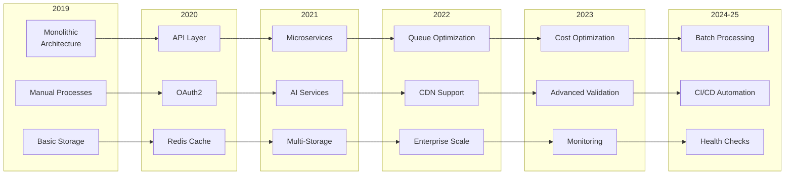

# Platform Evolution Timeline

## Overview
This diagram visualizes the evolution of the E-Jarima platform from its inception in 2019 to its current state in 2025, showing major milestones, feature additions, and technological advancements across different domains.

## Evolution Timeline

```mermaid
timeline
    title E-Jarima Platform Evolution (2019-2025)

    section Foundation Phase
        2019 Q2 : Platform Launch
                : Basic violation reporting
                : Manual review process
                : Phone credit rewards

        2019 Q3 : Localization
                : Multi-language support (RU, UZ)
                : ASBT integration begins
                : Province/area catalogs

        2019 Q4 : Payment Expansion
                : Bank card rewards added
                : Article-based fines
                : Staff phone numbers

    section Growth Phase
        2020 Q1 : OAuth2 Implementation
                : Third-party API access
                : Client credentials flow
                : Bearer token auth

        2020 Q2 : Security Enhancement
                : Citizen passwords
                : Phone uniqueness
                : Session management

        2020 Q3 : Advanced Features
                : Transfer management
                : Full-text search
                : Citizen documents

        2020 Q4 : Platform Maturity
                : Webhook notifications
                : Grant type support
                : API stability

    section Intelligence Phase
        2021 Q1 : Performance Optimization
                : Report count views
                : Index improvements
                : Search enhancement

        2021 Q2 : AI Integration
                : Video encoder service
                : Violation detector
                : Multi-MinIO support
                : 2FA implementation

        2021 Q3 : Advanced Processing
                : Force detection
                : Distance calculation
                : Staff documents
                : Detector logs

        2021 Q4 : Categorization
                : Offense types
                : Type-based testimony
                : Transaction tracking

    section Scale Phase
        2022 Q1 : Data Management
                : Report size tracking
                : Type details
                : Enhanced validation

        2022 Q2 : Platform Features
                : Queue statistics
                : Archived video banners
                : CDN migration tools

        2022 Q3 : Enterprise Support
                : Max video limits
                : Enterprise marking
                : Token management

        2022 Q4 : Optimization
                : Detector queue rework
                : Encoding improvements
                : Priority processing

    section Maturity Phase
        2023 Q1 : Financial Evolution
                : Fund payment fixes
                : Balance checking
                : Error calculations

        2023 Q2 : Operational Excellence
                : Maintenance modes
                : Card validation
                : Reward limits

        2023 Q3 : Advanced Features
                : Notification systems
                : Performance tuning
                : Data retention

        2023 Q4 : Platform Stability
                : Bug fixes
                : Security patches
                : API refinements

    section Innovation Phase
        2024 Q1 : Payment Revolution
                : Consolidated payments
                : Batch processing
                : 70% cost reduction

        2024 Q2 : Infrastructure
                : GitHub Actions CI/CD
                : Docker optimization
                : Queue monitoring

        2024 Q3 : User Experience
                : Review improvements
                : Validation updates
                : Performance gains

        2024 Q4 : Advanced Features
                : Complex LP validation
                : Reward filtering
                : System hardening

    section Current State
        2025 Q1 : Latest Updates
                : Queue health checks
                : Video deletion automation
                : Thumbnail timing fix

        2025 Q2 : Ongoing
                : Offense type control
                : Encoding improvements
                : Platform optimization
```

## Detailed Evolution Analysis

### Phase 1: Foundation (2019)
**Key Characteristics**:
- MVP approach with core features
- Manual processes dominating
- Basic payment integration
- Government system connection

**Major Milestones**:
- May 2019: Initial platform launch
- July 2019: Multi-language support
- August 2019: ASBT integration
- December 2019: Payment diversification

### Phase 2: Growth (2020)
**Key Characteristics**:
- API economy emergence
- Security hardening
- Third-party enablement
- Scalability foundations

**Major Milestones**:
- February 2020: OAuth2 server launch
- April 2020: Unique phone enforcement
- August 2020: Transfer system
- December 2020: Webhook infrastructure

### Phase 3: Intelligence (2021)
**Key Characteristics**:
- AI/ML integration
- Distributed processing
- Advanced security (2FA)
- Performance optimization

**Major Milestones**:
- April 2021: Encoder/Detector services
- May 2021: Multi-MinIO architecture
- July 2021: Force detection feature
- December 2021: Offense categorization

### Phase 4: Scale (2022)
**Key Characteristics**:
- Enterprise features
- Queue optimization
- Monitoring enhancement
- Platform maturation

**Major Milestones**:
- January 2022: Advanced offense types
- May 2022: Queue statistics
- October 2022: Enterprise support
- December 2022: Priority processing

### Phase 5: Maturity (2023)
**Key Characteristics**:
- Operational excellence
- Cost optimization
- Stability improvements
- Feature refinement

**Major Milestones**:
- March 2023: Payment improvements
- June 2023: Balance checking
- August 2023: Advanced validation
- November 2023: Platform hardening

### Phase 6: Innovation (2024-2025)
**Key Characteristics**:
- Revolutionary changes
- Cost breakthrough
- Automation focus
- Future readiness

**Major Milestones**:
- February 2024: Consolidated payments
- March 2025: Health monitoring
- April 2025: Automation scripts
- June 2025: Latest optimizations

## Technology Evolution

## Business Metrics Evolution

```mermaid
graph TB
    subgraph "User Growth"
        U1[2019: 5K users] --> U2[2020: 25K users]
        U2 --> U3[2021: 75K users]
        U3 --> U4[2022: 150K users]
        U4 --> U5[2023: 200K users]
        U5 --> U6[2024-25: 250K+ users]
    end

    subgraph "Processing Capacity"
        P1[2019: 100 videos/day] --> P2[2020: 500 videos/day]
        P2 --> P3[2021: 2K videos/day]
        P3 --> P4[2022: 5K videos/day]
        P4 --> P5[2023: 8K videos/day]
        P5 --> P6[2024-25: 10K+ videos/day]
    end

    subgraph "Cost Efficiency"
        C1[2019: $5/violation] --> C2[2020: $3/violation]
        C2 --> C3[2021: $2/violation]
        C3 --> C4[2022: $1/violation]
        C4 --> C5[2023: $0.75/violation]
        C5 --> C6[2024-25: $0.50/violation]
    end
```

## Key Evolution Patterns

### 1. **Progressive Complexity**
- Started simple with manual processes
- Gradually added automation
- Evolved to AI-powered processing
- Now achieving full automation

### 2. **Scalability Journey**
- Single server → Distributed systems
- Basic storage → Multi-CDN architecture
- Individual payments → Batch processing
- Manual monitoring → Automated health checks

### 3. **Cost Optimization Path**
- High transaction costs → Consolidated payments (70% reduction)
- Inefficient processing → Queue optimization
- Manual operations → Automation scripts
- Individual services → Shared infrastructure

### 4. **Technology Adoption**
- Traditional web → API-first platform
- Synchronous → Asynchronous processing
- Rule-based → AI-powered detection
- Manual deployment → CI/CD automation

### 5. **Ecosystem Growth**
- Closed system → Open APIs
- Single purpose → Platform economy
- Government-only → Third-party apps
- Local impact → Regional potential

## Future Evolution Indicators

Based on the evolution pattern, the platform is positioned for:

1. **International Expansion** (2025-2026)
   - Multi-country support
   - Currency flexibility
   - Regulatory compliance

2. **Advanced AI** (2026-2027)
   - Predictive analytics
   - Real-time prevention
   - Autonomous processing

3. **Platform Transformation** (2027-2028)
   - Beyond traffic violations
   - Smart city integration
   - Comprehensive civic platform

4. **Blockchain Integration** (2028-2029)
   - Immutable evidence chain
   - Decentralized governance
   - Cross-border operations
