# Stakeholder Ecosystem Diagram

## Overview
This diagram visualizes the complex ecosystem of stakeholders in the Jarima platform, showing their relationships, interactions, and value exchanges. It demonstrates how the platform creates a multi-sided marketplace connecting citizens, government, businesses, and developers.

## Ecosystem Diagram

```mermaid
graph TB
    subgraph "Primary Stakeholders"
        Citizens[Citizens<br/>250,000+ users]
        Govt[Government<br/>Traffic Safety Dept]
        Staff[Staff/Inspectors<br/>Review violations]
    end

    subgraph "Platform Core"
        JP[Jarima Platform<br/>- Video Processing<br/>- Violation Management<br/>- Payment Distribution]
    end

    subgraph "Business Ecosystem"
        PayProv[Payment Providers<br/>- Kash<br/>- UzCard]
        TelOp[Telecom Operators<br/>- Beeline<br/>- Ucell<br/>- UzMobile]
        Banks[Banks<br/>Card Issuers]
    end

    subgraph "Developer Ecosystem"
        DevCom[Developer Community<br/>500+ developers]
        TPApps[Third-party Apps<br/>15+ applications]
        StartUps[Civic Tech Startups<br/>20+ companies]
    end

    subgraph "Service Providers"
        Cloud[Cloud Infrastructure<br/>- Storage MinIO<br/>- Compute]
        AI[AI Services<br/>- Encoder<br/>- Detector]
        Comms[Communication<br/>- SMS<br/>- Telegram]
    end

    subgraph "Beneficiaries"
        Society[Society<br/>- Safer Roads<br/>- Reduced Violations]
        Orgs[Organizations<br/>Fleet Management]
        Research[Researchers<br/>Traffic Studies]
    end

    subgraph "Regulatory"
        ASBT[ASBT<br/>Traffic Authority]
        Legal[Legal Framework<br/>- Data Privacy<br/>- Evidence Laws]
        Policy[Policy Makers<br/>Traffic Regulations]
    end

    %% Primary flows
    Citizens -->|Reports<br/>Videos| JP
    JP -->|Rewards<br/>$10M+| Citizens
    Staff -->|Reviews<br/>Decisions| JP
    JP -->|Violations<br/>Evidence| ASBT
    ASBT -->|Fines<br/>Status| JP
    Govt -->|Oversight<br/>Policy| JP

    %% Business ecosystem
    JP -->|Payments| PayProv
    PayProv -->|Credits| TelOp
    PayProv -->|Transfers| Banks
    Banks -->|Services| Citizens

    %% Developer ecosystem
    JP -->|APIs<br/>Data| DevCom
    DevCom -->|Apps<br/>Innovation| TPApps
    TPApps -->|Services| Citizens
    DevCom -->|Startups| StartUps

    %% Service providers
    JP -->|Videos| Cloud
    JP -->|Processing| AI
    JP -->|Messages| Comms
    Cloud -->|Storage| JP
    AI -->|Detection| JP
    Comms -->|Delivery| Citizens

    %% Beneficiaries
    JP -->|Data<br/>Insights| Society
    JP -->|Fleet API| Orgs
    JP -->|Analytics| Research
    Orgs -->|Reports| JP

    %% Regulatory
    ASBT -->|Requirements| JP
    Legal -->|Compliance| JP
    JP -->|Evidence| Legal
    JP -->|Statistics| Policy
    Policy -->|Regulations| ASBT

    %% Styling
    classDef primary fill:#bbdefb,stroke:#1565c0,stroke-width:3px
    classDef platform fill:#c8e6c9,stroke:#2e7d32,stroke-width:4px
    classDef business fill:#fff9c4,stroke:#f57f17,stroke-width:2px
    classDef developer fill:#e1bee7,stroke:#6a1b9a,stroke-width:2px
    classDef service fill:#ffccbc,stroke:#d84315,stroke-width:2px
    classDef benefit fill:#b2dfdb,stroke:#00695c,stroke-width:2px
    classDef regulatory fill:#f8bbd0,stroke:#c2185b,stroke-width:2px

    class Citizens,Govt,Staff primary
    class JP platform
    class PayProv,TelOp,Banks business
    class DevCom,TPApps,StartUps developer
    class Cloud,AI,Comms service
    class Society,Orgs,Research benefit
    class ASBT,Legal,Policy regulatory
```

## Stakeholder Categories

### Primary Stakeholders
These are the core users and operators of the platform:

1. **Citizens (250,000+ users)**
   - Submit violation reports
   - Receive monetary rewards
   - Track report status
   - **Value Exchange**: Reports for rewards

2. **Government (Traffic Safety Department)**
   - Owns and oversees platform
   - Sets policies and regulations
   - Monitors effectiveness
   - **Value Exchange**: Funding for enforcement

3. **Staff/Inspectors**
   - Review submitted violations
   - Make forwarding decisions
   - Manage disputed cases
   - **Value Exchange**: Employment for service

### Platform Core
The Jarima platform serves as the central orchestrator:
- Processes videos and manages violations
- Distributes payments and notifications
- Provides APIs and integrations
- Maintains data integrity and security

### Business Ecosystem
Financial and telecommunications partners enabling operations:

1. **Payment Providers**
   - Kash: Phone credit distribution
   - UzCard: Bank card transfers
   - **Value**: Transaction fees (~$1M annually)

2. **Telecom Operators**
   - Receive phone credit purchases
   - Provide SMS services
   - **Value**: Increased ARPU from credits

3. **Banks**
   - Process card transactions
   - Provide payment infrastructure
   - **Value**: Transaction volume and fees

### Developer Ecosystem
Innovation partners extending platform capabilities:

1. **Developer Community (500+ members)**
   - Build third-party applications
   - Contribute to platform improvement
   - **Value**: API access and data

2. **Third-party Apps (15+ active)**
   - Navigation and safety apps
   - Fleet management solutions
   - Legal service platforms
   - **Value**: User base access

3. **Civic Tech Startups (20+ companies)**
   - Build on platform APIs
   - Create innovative solutions
   - **Value**: Platform and expertise

### Service Providers
Technical infrastructure enabling platform operations:

1. **Cloud Infrastructure**
   - MinIO for object storage
   - Compute resources
   - **Value**: ~$500K annual contracts

2. **AI Services**
   - Video encoding service
   - Violation detection AI
   - **Value**: Processing fees

3. **Communication Services**
   - SMS providers
   - Telegram integration
   - **Value**: Message delivery fees

### Beneficiaries
Indirect stakeholders gaining value from platform operations:

1. **Society**
   - Safer roads (150-200 lives saved annually)
   - Reduced traffic violations (40% decrease)
   - **Value**: Public safety improvement

2. **Organizations**
   - Fleet violation management
   - Driver behavior monitoring
   - **Value**: Operational efficiency

3. **Researchers**
   - Access to traffic data
   - Behavioral studies
   - **Value**: Research insights

### Regulatory Framework
Government bodies providing oversight and compliance:

1. **ASBT (Traffic Authority)**
   - Receives violation evidence
   - Issues official fines
   - **Value**: Enforcement efficiency

2. **Legal Framework**
   - Data privacy regulations
   - Evidence admissibility
   - **Value**: Legal compliance

3. **Policy Makers**
   - Use data for policy decisions
   - Create traffic regulations
   - **Value**: Evidence-based policy

## Value Flow Analysis

### Monetary Flows
- **Citizens → Platform**: Free service
- **Platform → Citizens**: $10M+ in rewards
- **Platform → Payment Providers**: ~$300K in fees
- **Government → Platform**: Operational funding
- **ASBT → Violators**: Fine collection

### Data Flows
- **Citizens → Platform**: Violation videos and reports
- **Platform → ASBT**: Verified violations
- **Platform → Developers**: APIs and analytics
- **Platform → Researchers**: Anonymized data
- **Platform → Policy Makers**: Statistics

### Service Flows
- **Platform → Citizens**: Violation processing
- **Staff → Citizens**: Fair review process
- **Developers → Citizens**: Enhanced services
- **Platform → Organizations**: Fleet management

## Network Effects

1. **Direct Network Effects**
   - More citizens = better coverage
   - More reports = safer roads
   - More developers = better apps

2. **Indirect Network Effects**
   - More violations processed = more rewards
   - More rewards = more citizens
   - More data = better AI detection

3. **Ecosystem Network Effects**
   - More apps = more user engagement
   - More engagement = more platform value
   - More value = more ecosystem growth

## Strategic Insights

1. **Multi-sided Platform**: Successfully balances interests of citizens, government, and businesses
2. **Ecosystem Orchestration**: Platform acts as central value creator and distributor
3. **Sustainable Model**: Self-reinforcing growth through network effects
4. **Social Impact**: Delivers measurable public safety benefits
5. **Innovation Hub**: Enables third-party innovation and entrepreneurship
