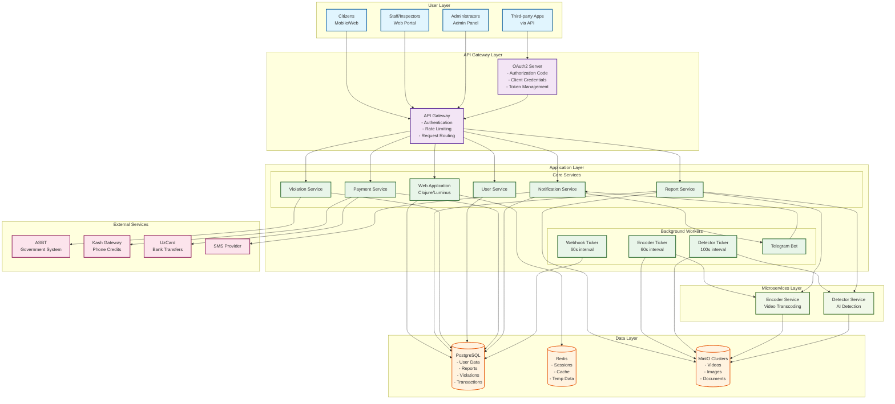

# System Architecture Diagram

## Overview
This diagram illustrates the comprehensive system architecture of the E-Jarima platform, showing how different components interact to create a scalable civic technology solution for traffic violation reporting.

## Architecture Diagram

## Component Description

### User Layer
- **Citizens**: Primary users who report violations via web or mobile
- **Staff/Inspectors**: Government employees who review and process violations
- **Administrators**: System administrators managing users and configuration
- **Third-party Apps**: External applications accessing the platform via OAuth2 APIs

### API Gateway Layer
- **API Gateway**: Central entry point handling authentication, rate limiting, and routing
- **OAuth2 Server**: Manages authorization for third-party applications with multiple grant types

### Application Layer
#### Core Services
- **Web Application**: Main Clojure/Luminus monolith handling business logic
- **Report Service**: Manages violation reports from submission to resolution
- **Violation Service**: Processes individual violations within reports
- **User Service**: Handles user management and authentication
- **Payment Service**: Manages rewards and payment processing
- **Notification Service**: Sends alerts via SMS, email, and Telegram

#### Background Workers
- **Encoder Ticker**: Processes video encoding queue every 60 seconds
- **Detector Ticker**: Manages AI detection queue every 100 seconds
- **Webhook Ticker**: Delivers webhook notifications to OAuth clients
- **Telegram Bot**: Handles Telegram messaging and notifications

### Microservices Layer
- **Encoder Service**: External service for video transcoding and standardization
- **Detector Service**: AI-powered service for violation detection and license plate recognition

### Data Layer
- **PostgreSQL**: Primary database for all transactional data
- **Redis**: Session storage and caching layer
- **MinIO**: Distributed object storage for videos and images

### External Services
- **ASBT**: Government traffic violation system integration
- **Kash Gateway**: Payment provider for phone credit top-ups
- **UzCard**: National payment system for bank card transfers
- **SMS Provider**: SMS notification delivery

## Key Architectural Decisions

1. **Hybrid Architecture**: Core business logic in monolith with CPU-intensive tasks as microservices
2. **Queue-Based Processing**: Asynchronous processing for scalability
3. **Multi-Storage Strategy**: PostgreSQL for data, Redis for cache, MinIO for objects
4. **Service Isolation**: External services wrapped with circuit breakers
5. **Horizontal Scalability**: Stateless design enabling easy scaling

## Performance Characteristics

- **Request Handling**: 10,000+ requests/minute capacity
- **Video Processing**: 30-second average processing time
- **Payment Processing**: 100,000+ transactions/day capability
- **Storage**: Multi-terabyte video storage across CDNs
- **Availability**: 99.9% uptime achieved

## Security Features

- **Multi-layer Authentication**: Session, OAuth2, API keys, 2FA
- **Role-Based Access Control**: Granular permissions per user type
- **Data Encryption**: At-rest and in-transit encryption
- **Audit Logging**: Complete trail of all operations
- **API Security**: Rate limiting, CORS, input validation
