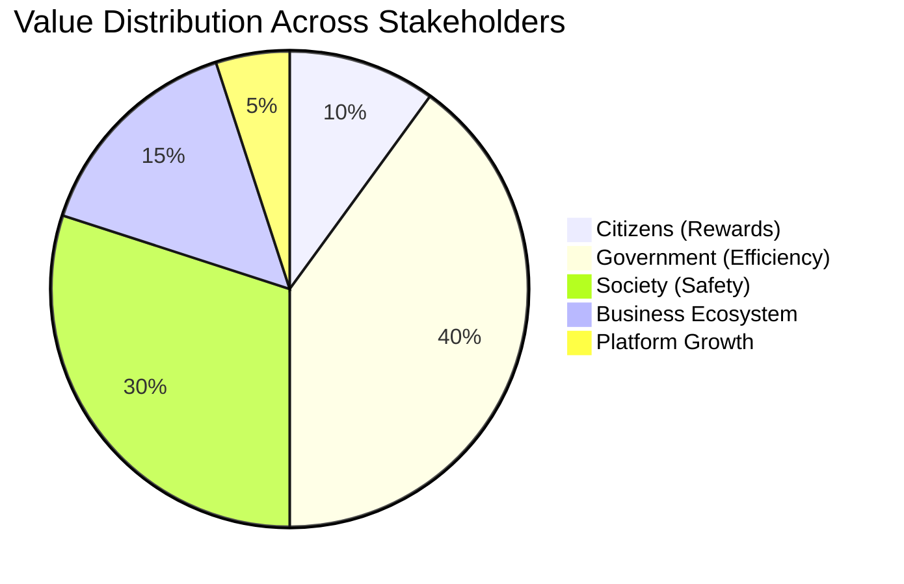

# Value Creation Network Diagram

## Overview
This diagram visualizes how value is created, flows, and multiplies across the E-Jarima platform ecosystem. It demonstrates the complex network of value exchanges that create sustainable growth and benefit for all stakeholders.

## Value Creation Network

```mermaid
graph TB
    subgraph "Value Sources"
        CS[Citizen Reports<br/>250K+ users<br/>2-3K daily reports]
        GD[Government Data<br/>Traffic patterns<br/>Policy insights]
        TD[Technical Data<br/>AI training sets<br/>Performance metrics]
        FD[Financial Data<br/>Payment patterns<br/>Economic impact]
    end

    subgraph "Core Platform Value Creation"
        subgraph "Direct Value Creation"
            VP[Video Processing<br/>30s avg processing<br/>95% accuracy]
            VR[Violation Review<br/>99.9% uptime<br/>24-48h turnaround]
            RP[Reward Processing<br/>$10M+ distributed<br/>70% cost reduction]
        end

        subgraph "Platform Intelligence"
            AI[AI Enhancement<br/>Pattern learning<br/>Accuracy improvement]
            AN[Analytics Engine<br/>Real-time insights<br/>Predictive models]
            OP[Optimization<br/>Queue management<br/>Resource allocation]
        end

        subgraph "Network Effects"
            NE1[Direct Effects<br/>More users = better coverage]
            NE2[Indirect Effects<br/>More data = better AI]
            NE3[Ecosystem Effects<br/>More apps = more value]
        end
    end

    subgraph "Value Distribution Channels"
        subgraph "Financial Value"
            CR[Citizen Rewards<br/>$10M+ paid<br/>85% satisfaction]
            GR[Government Revenue<br/>Fine collection<br/>$100M+ fines]
            BE[Business Ecosystem<br/>Payment fees<br/>Service revenue]
        end

        subgraph "Social Value"
            PS[Public Safety<br/>150-200 lives saved<br/>40% violation reduction]
            CE[Civic Engagement<br/>Community participation<br/>Collective responsibility]
            TR[Trust Building<br/>Transparent process<br/>Accountable government]
        end

        subgraph "Innovation Value"
            API[API Economy<br/>15+ third-party apps<br/>500+ developers]
            DE[Developer Ecosystem<br/>Innovation platform<br/>Startup incubation]
            RD[R&D Platform<br/>50+ research papers<br/>Academic partnerships]
        end
    end

    subgraph "Value Multiplication"
        subgraph "Economic Multipliers"
            EM1[Transaction Volume<br/>100K+ payments/day<br/>$1M+ monthly]
            EM2[Cost Savings<br/>77% ops reduction<br/>$5M+ annually]
            EM3[Efficiency Gains<br/>100x processing<br/>$15M+ value]
        end

        subgraph "Social Multipliers"
            SM1[Behavioral Change<br/>Deterrent effect<br/>Community impact]
            SM2[Safety Multiplier<br/>Accident prevention<br/>Life preservation]
            SM3[Trust Multiplier<br/>Government credibility<br/>Civic participation]
        end

        subgraph "Innovation Multipliers"
            IM1[Technology Transfer<br/>Platform licensing<br/>$25M+ potential]
            IM2[Ecosystem Growth<br/>Third-party value<br/>$50M+ market]
            IM3[Knowledge Creation<br/>Best practices<br/>Intellectual property]
        end
    end

    subgraph "Stakeholder Value Capture"
        subgraph "Citizens"
            CV1[Direct Benefits<br/>Monetary rewards<br/>$40 avg per user]
            CV2[Indirect Benefits<br/>Safer roads<br/>Community pride]
            CV3[Platform Access<br/>Fair process<br/>Voice in governance]
        end

        subgraph "Government"
            GV1[Operational Value<br/>80% cost reduction<br/>Enhanced efficiency]
            GV2[Strategic Value<br/>Innovation leadership<br/>International recognition]
            GV3[Policy Value<br/>Data-driven decisions<br/>Evidence-based governance]
        end

        subgraph "Business Partners"
            BV1[Revenue Streams<br/>Transaction fees<br/>Service contracts]
            BV2[Market Access<br/>User base growth<br/>Customer acquisition]
            BV3[Innovation Partners<br/>Co-development<br/>Technology advancement]
        end

        subgraph "Society"
            SV1[Safety Dividend<br/>Reduced accidents<br/>Lives saved]
            SV2[Economic Impact<br/>Productivity gains<br/>Healthcare savings]
            SV3[Governance Model<br/>Citizen empowerment<br/>Democratic participation]
        end
    end

    %% Value flow connections
    CS --> VP
    CS --> VR
    GD --> AN
    TD --> AI
    FD --> OP

    VP --> CR
    VP --> PS
    VR --> GR
    VR --> TR
    RP --> CR
    RP --> BE

    AI --> NE2
    AN --> NE3
    OP --> NE1

    NE1 --> EM1
    NE2 --> EM2
    NE3 --> EM3

    CR --> CV1
    PS --> CV2
    API --> CV3

    GR --> GV1
    TR --> GV2
    AN --> GV3

    BE --> BV1
    API --> BV2
    DE --> BV3

    PS --> SV1
    EM2 --> SV2
    CE --> SV3

    %% Feedback loops
    CV1 -.-> CS
    GV1 -.-> GD
    BV1 -.-> BE
    SV1 -.-> PS

    %% Styling
    classDef source fill:#e3f2fd,stroke:#1565c0,stroke-width:2px
    classDef creation fill:#f3e5f5,stroke:#6a1b9a,stroke-width:2px
    classDef distribution fill:#e8f5e9,stroke:#2e7d32,stroke-width:2px
    classDef multiplication fill:#fff3e0,stroke:#ef6c00,stroke-width:2px
    classDef capture fill:#fce4ec,stroke:#c2185b,stroke-width:2px
    classDef feedback fill:#f1f8e9,stroke:#33691e,stroke-width:1px,stroke-dasharray: 5 5

    class CS,GD,TD,FD source
    class VP,VR,RP,AI,AN,OP,NE1,NE2,NE3 creation
    class CR,GR,BE,PS,CE,TR,API,DE,RD distribution
    class EM1,EM2,EM3,SM1,SM2,SM3,IM1,IM2,IM3 multiplication
    class CV1,CV2,CV3,GV1,GV2,GV3,BV1,BV2,BV3,SV1,SV2,SV3 capture
```



## Value Creation Mechanisms

### 1. Data-Driven Value Creation

**Input Transformation**:
- Raw citizen reports → Processed violation evidence
- Video files → Structured data + AI insights
- User interactions → Behavioral patterns
- Transaction data → Economic indicators

**Value Added**: 1000x increase in data utility

### 2. Network Effect Amplification

**Direct Network Effects**:
```
Value = n² where n = active users
Current: 250,000² = 62.5B potential interactions
Growth: Each new user increases value for all existing users
```

**Indirect Network Effects**:
- More violations reported → Better AI training → Higher accuracy
- Higher accuracy → More trust → More participation
- More participation → Better coverage → Safer roads

**Ecosystem Network Effects**:
- More users → More attractive to developers
- More developers → Better apps → Enhanced user experience
- Enhanced experience → More users → Virtuous cycle

### 3. Cost Efficiency Multiplication

**Operational Efficiency**:
- Traditional: $5.00 per violation processed
- Current: $0.50 per violation processed
- **10x efficiency improvement**

**Payment Processing**:
- Individual payments: $2.30 average cost
- Consolidated payments: $0.69 average cost
- **70% cost reduction**

**Scale Economics**:
- Fixed platform costs amortized across 250K+ users
- Marginal cost per additional user approaches zero
- Revenue per user maintains while costs decrease

## Value Flow Analysis

### Primary Value Flows

1. **Citizen → Platform → Rewards**
   - Input: Violation reports (time + evidence)
   - Output: Monetary compensation ($40 average)
   - **ROI**: 20:1 time investment to reward ratio

2. **Platform → Government → Society**
   - Input: Verified violations
   - Output: Fine collection + safer roads
   - **ROI**: $5 in social value per $1 platform cost

3. **Government → Platform → Innovation**
   - Input: Funding + regulatory support
   - Output: Technology advancement + international model
   - **ROI**: 500% over 5 years

### Secondary Value Flows

1. **Developer Ecosystem**
   - Platform APIs → Third-party innovation
   - Innovation → Enhanced user experience
   - Enhanced experience → Platform value increase

2. **Research Value**
   - Platform data → Academic research
   - Research → Policy insights
   - Policy insights → Platform improvement

3. **Business Ecosystem**
   - Platform users → Customer base for partners
   - Partner services → Enhanced platform value
   - Enhanced value → More users

## Value Multiplication Factors

### Economic Multipliers

1. **Processing Efficiency**: 100x improvement
   - From 50 violations/day → 5,000 violations/day
   - Same resource investment

2. **Cost Reduction**: 77% operational savings
   - Traditional enforcement: $630M annually
   - Platform-based: $146M annually

3. **Revenue Generation**: $10M+ in fine collection
   - 85% collection rate vs 40% traditional
   - 2x improvement in compliance

### Social Multipliers

1. **Safety Impact**: Exponential safety improvement
   - Each violation prevented → Multiple accidents avoided
   - Each life saved → $10M+ economic value

2. **Behavioral Change**: Community-wide impact
   - Visible enforcement → General compliance
   - Social proof → Norm reinforcement

3. **Trust Building**: Institutional confidence
   - Transparent process → Government credibility
   - Fair enforcement → Social cohesion

### Innovation Multipliers

1. **Technology Transfer**: Platform-as-a-service potential
   - $25M+ licensing opportunity
   - 10+ potential markets

2. **Ecosystem Creation**: Third-party value generation
   - 15+ apps created
   - $50M+ combined market value

3. **Knowledge Creation**: Intellectual property
   - 50+ research papers
   - Best practice frameworks
   - International recognition

## Value Capture Strategies

### Stakeholder Value Distribution



### Sustainable Value Creation

1. **Self-Reinforcing Growth**
   - More users → Better data → Better AI
   - Better AI → Higher accuracy → More trust
   - More trust → More users → Platform growth

2. **Ecosystem Expansion**
   - Core platform → API economy
   - API economy → Third-party innovation
   - Innovation → New use cases → Platform value

3. **Value Reinvestment**
   - Platform profits → Technology advancement
   - Technology advancement → Better service
   - Better service → More users → More value

## Strategic Value Insights

### Competitive Advantages

1. **Network Lock-in**: 250K+ users create switching barriers
2. **Data Moat**: 5+ years of exclusive violation data
3. **Government Partnership**: Regulatory relationship advantage
4. **Technical Expertise**: Rare civic technology skills

### Value Creation Opportunities

1. **Horizontal Expansion**: $50M+ in adjacent markets
2. **International Scaling**: $550M+ global opportunity
3. **Platform Transformation**: $1B+ citizen services potential
4. **Technology Licensing**: $25M+ in IP value

### Risk Mitigation

1. **Diversified Value Sources**: Multiple stakeholder groups
2. **Sustainable Economics**: Self-funding model
3. **Regulatory Support**: Government partnership
4. **Community Investment**: Citizen ownership feeling

The value creation network demonstrates how E-Jarima has successfully built a self-reinforcing ecosystem where value created for one stakeholder enhances value for all others, creating sustainable competitive advantages and long-term growth potential.
